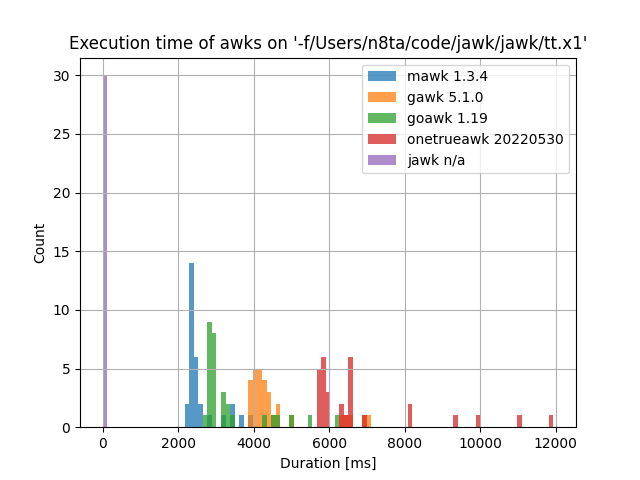
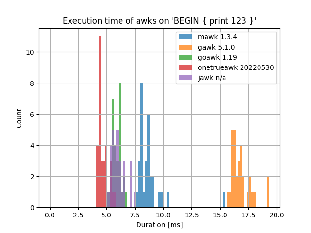

## What is it?
An (INCOMPLETE) jit compiled awk (jawk) implementation leveraging GNU libjit. The goal is the to be the fastest awk for all programs.

## Performance

### Best case scenario for jawk
A long running mostly numeric program with little io. Not very representation of most awk programs since awk program usually do a lot of IO. 
JIT provides the most benefit here since JIT'ed math is vastly faster than interpreted. For this we use generating mandelbrot set as ascii art (see tt.x1 in the repo). This is highly numeric followed by a few quick prints.




That chart is not a mistake. A normal run of this program for jawk (on my 2015 laptop) is 170ms vs >2s for all other awks. 

### Worse case scenario for jawk (short program, JIT provides no benefit)


Here we see jawk is doing okay but the interpreters are much closer and onetrueawk, the lightest of the interpreters, is generally slightly faster.

### Practical example

(TODO)

## Limitations

jawk doesn't support all of awk yet. Lots of builtins are missing and IO other than print is barely optimized. Files are read in there 
entirety up front (they should be streamed as needed). 

If gnu-lightjib the backing jit compiler doesn't have a backend for your system jawk will fallback to an interpreter
and lose most performance gains.

## Character encodings
The awk spec states that 

>The index, length, match, and substr functions should not be confused with similar functions in the ISO C standard; the awk versions deal with characters, while the ISO C standard deals with bytes.

To this end jawk uses utf8 codepoints as characters for these functions. If invalid utf-8 data is parsed from a file jawk will emit a warning and any 
length calculation will return bytes for a non utf-8 compliant string.

jawk does not support any other locale eg. `LC_ALL=C` yet.

## How to use

### Ubuntu:
```
sudo apt-get install autoconf pkg-config libtool flex bison automake make g++
cargo build --release
``` 

### Mac:
```
brew install autoconf automake libtool gcc
```

### Windows
For now you need to use WSL and follow the ubuntu instructions

### General:
```
cargo build
./target/debug/jawk '{ print "Some awk program!}" }' 
./target/debug/jawk -f run.awk some_file.txt
cargo run -- --debug 'BEGIN { print "this will print debug info including the AST and runtime calls" }'
```

## Todo:

1. Reading from stdin
2. Native string functions gsub, index, length, match, split, sprintf, sub, substr, tolower, toupper
3. Redirect output to file
   - close() function
4. ARGV / ARGC and other ENV vars
Pattern Ranges 
5. Parser need to be able to print the where it was when shit went wrong and what happened
6. Do we actually need numeric strings??? (Yes there are now commented tests for them)
7. The columns runtime needs to be much faster and lazier.
7. Make this compile on Windows!
8. Divide by 0 needs to print an error

## License
GNU Libjit is GPLv2. (./gnu-libjit-sys/LICENSE)
Mawk is GPLv2 (./mawk-regex-sys/LICENSE)
This project is GPLv2.

## Running the tests

Install other awks to test against (they should be on your path with these exact names)
1. gawk (linux/mac you already have it)
2. [mawk](https://invisible-island.net/mawk/) - build from src
3. [goawk](https://github.com/benhoyt/goawk) - need the go toolchain, then go get
4. [onetrueawk](https://github.com/onetrueawk/awk) - super easy and fast build from src

Tests by default just check correctness against other awks and oracle result.

```
cargo test
```

### Perf tests
If you want to run perf tests set the env var "jperf" to "true" and do a `cargo build --release` and `cargo test -- --test-threads=1` first. This will test the speed of the release binary against other awks.
